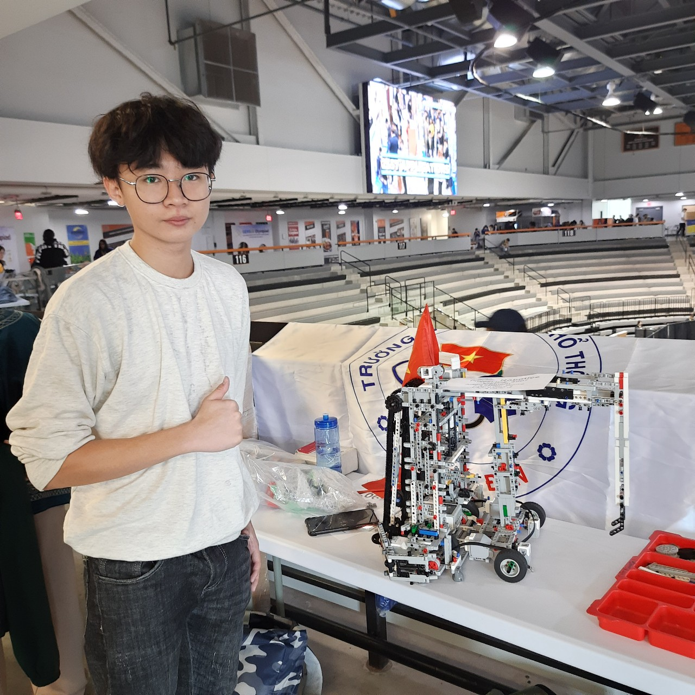

# Application Portfolio

> "Systems don't build themselves. Problems don't debug themselves. I ship solutions, not theories."

## About Me
I'm Phong D. Lam (english name: Fredrick Lam), engineering systems that work in the real world—from autonomous robots navigating chaos to AI detecting crop diseases in Vietnamese rice fields.

**Current Mission:** Building agricultural AI that serves 22M farmers. **Next Mission:** Immersive Software Engineering at JYU, 

[Genius Olympiad 2024 NY,US - Robotics 🥉] [Tin Học Trẻ National Finals 2025 🏆] [Science Research competition city-level Software engineering 2024 🥉 ] [AWARDS FOR DESIGN, INNOVATION, AND APPLICATION OF SOFTWARE AND APPLICATION CREATION BOARDS 2025 🥉] [National Youth Innovation Competition 2025 - Information Technology Field Final Round 🏆] [Ho Chi Minh City Academic Club and Team Festival 2024 🥇] [Leader of The Genius Science and Technology Club 2025-2026] [Anti-conformist by design]

## Software engineering skills (major)
- **Programming Languages**: Python, JavaScript, C++ (a little bit) , TypeScript, Java (a little bit)
- **Frontend**:ReactJS,TailwindCSS
- **Backend**:NodeJS,ExpressJS
- **Cloud&DevOps**: AWS S3, Docker ,Kubernetes ,CI/CD pipelines
- **AI/ML**: PyTorch, TensorFlow,YOLO, OpenCV; model fine‑tuning; evaluation metrics; deployment for inference.
- **Database**: MongoDB, SQL , Firebase
- **Technique** : Advanced prompt engineering ;Agent AI engineering ; RESTful API; Data structure
- **Tools**: Git flow, Cloudinary, Trello ,Asana, Figma
- **Concepts**: Algorithmic Thinking, Discrete Math

## Robotics engineering skills (minor/hobby)
- **Stacks & integration**: ROS/ROS2 (packages, nodes, topics, launch files), MoveIt (basic motion planning), Lego Ev3  , VEX robotics
- **Simulation for validation**: Webots, CoppeliaSim, Gazebo (scenario setup, sensor models, KPIs)
- **Embedded bridge**:ESP32, Raspberry Pi,Arduino (firmware integration, UART/SPI/I2C, CAN)
- **Control & planning (practical scope)**: PID tuning, trajectory tracking, forward/inverse kinematics for common platforms
- **Perception & SLAM (applied):** : OpenCV + YOLO inference, sensor fusion basics, visual/LiDAR SLAM at prototype level
- **AI integration:** Gemini 1.5 Robotics ER 
- **Realtime & protocols**: Latency budgeting, MQTT/TCP/UDP, message timing, logging/telemetry

## Projects/Achievements

1. **GENIUS Olympiad Robotics 2024**
- Achievement : Bronze Medal [GENIUS Olympiad 2024 Certification](.mp4)
- Description: One of my first prominent and big project in my ambition journey as a totally freshman in both high school period and my ambition journey
- Story(beta) :
- Year / Timeline: 11/2023 - 6/2024 
- Tech: Arduino(as a plug-and-play module for creating more capacities and also enhancing ), Python (ROS), ML for object detection.
- Role: Leader - Handled tech conflicts using STAR method.
- [Repo Link](link) | [Demo Video](video.mp4)

2. **Tin Học Trẻ Competition**
- Description: Developed algorithm for optimization problem (e.g., shortest path).
- Tech: Pseudocode to Python implementation.
- [Code Snippet](snippet.py)

3. **Internal tools

## Contact
phonglam@example.com | [LinkedIn](link)
